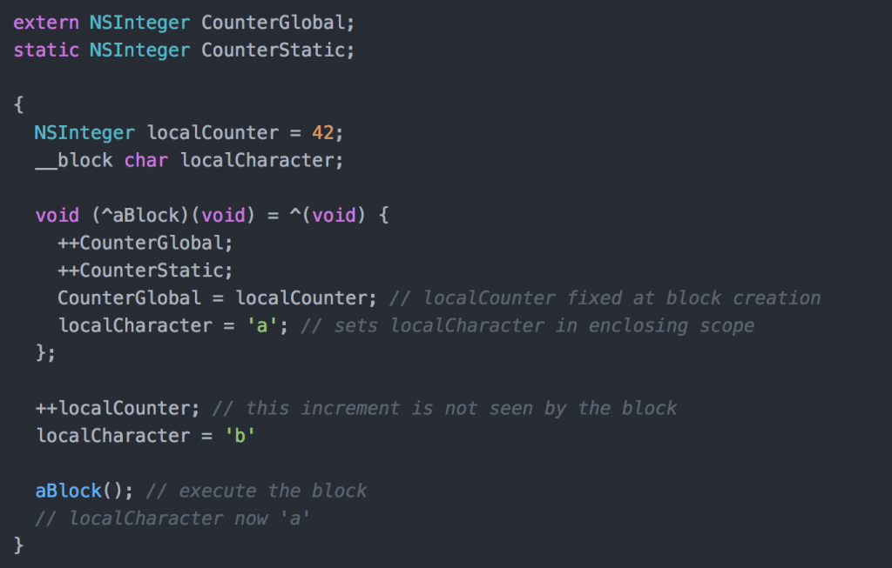

# Objective-C Style Guide
***by: Stephen Clark (various original sources)***

## Introduction

Here are some of the documents from Apple that informed the style guide. If something isn’t mentioned here, it’s probably covered in great detail in one of these:

* [The Objective-C Programming Language](http://developer.apple.com/library/mac/#documentation/Cocoa/Conceptual/ObjectiveC/Introduction/introObjectiveC.html)
* [Cocoa Fundamentals Guide](https://developer.apple.com/library/mac/#documentation/Cocoa/Conceptual/CocoaFundamentals/Introduction/Introduction.html)
* [Coding Guidelines for Cocoa](https://developer.apple.com/library/mac/#documentation/Cocoa/Conceptual/CodingGuidelines/CodingGuidelines.html)
* [iOS App Programming Guide](http://developer.apple.com/library/ios/#documentation/iphone/conceptual/iphoneosprogrammingguide/Introduction/Introduction.html)

Table of Contents
====
- [Objective-C Style Guide](#objective-c-style-guide)
  - [Introduction](#introduction)
- [Table of Contents](#table-of-contents)
- [Properties](#properties)
  - [Format](#format)
  - [Array Format](#array-format)
  - [Dictionary Format](#dictionary-format)
  - [Primitive Format](#primitive-format)
  - [Outlet Format](#outlet-format)
- [Variable Property Attributes or Modifiers](#variable-property-attributes-or-modifiers)
  - [Atomicity](#atomicity)
  - [Access](#access)
  - [Storage](#storage)
- [Private Properties](#private-properties)
- [Generics](#generics)
  - [Arrays](#arrays)
  - [Dictionaries](#dictionaries)
- [Nullability Annotations](#nullability-annotations)
  - [Constants](#constants)
  - [Properties](#properties-1)
  - [Methods](#methods)
  - [Blocks](#blocks)
  - [Adding nullability annotations to existing classes](#adding-nullability-annotations-to-existing-classes)
- [Method Declarations](#method-declarations)
- [Importing Apple Frameworks](#importing-apple-frameworks)
- [Header Files (.h)](#header-files-h)
- [Implementation Files (.m)](#implementation-files-m)
- [Constants](#constants-1)
- [Getters, Setters and Ivars](#getters-setters-and-ivars)
- [Dot Notation](#dot-notation)
- [Grouping Properties](#grouping-properties)
- [Grouping Methods](#grouping-methods)
- [Checking for nil](#checking-for-nil)
- [Checking for nil or empty strings](#checking-for-nil-or-empty-strings)
- [Enumeration](#enumeration)
  - [Fast enumeration](#fast-enumeration)
  - [For loop](#for-loop)
- [instancetype](#instancetype)
- [Safe Casting](#safe-casting)
- [Allocating and Initialising Objects](#allocating-and-initialising-objects)
- [Object Initialisers](#object-initialisers)
- [Custom Objects](#custom-objects)
- [Switch Statements](#switch-statements)
- [Enums](#enums)
- [Arrays](#arrays-1)
- [Dictionaries](#dictionaries-1)
- [64bit Compatible Types](#64bit-compatible-types)
- [Table/ Collection View Reuse Identifiers](#table-collection-view-reuse-identifiers)
- [Completion block parameter formatting](#completion-block-parameter-formatting)
- [Clearing UI](#clearing-ui)
- [Singleton Pattern](#singleton-pattern)
- [Blocks](#blocks-1)
  - [`__block` Variables](#__block-variables)
- [Retain Cycles in ARC using blocks](#retain-cycles-in-arc-using-blocks)
- [CGGeometry](#cggeometry)
- [String replacement](#string-replacement)
- [Commenting](#commenting)
- [Fonts and Colours](#fonts-and-colours)
- [File Management](#file-management)
- [General](#general)
- [Spacing](#spacing)
- [Conditionals](#conditionals)
    - [Ternary Operator](#ternary-operator)
- [Error Handling](#error-handling)
- [Methods](#methods-1)
- [Variables](#variables)
      - [Variable Qualifiers](#variable-qualifiers)
- [Naming](#naming)
    - [Categories](#categories)
- [init and dealloc](#init-and-dealloc)
- [Literals](#literals)
- [`CGRect` Functions](#cgrect-functions)
- [Constants](#constants-2)
- [Bitmasks](#bitmasks)
- [Image Naming](#image-naming)
- [Booleans](#booleans)
- [Singletons](#singletons)
- [Imports](#imports)
- [Protocols](#protocols)
- [Xcode project](#xcode-project)
- [Other Objective-C Style Guides](#other-objective-c-style-guides)


Properties
======

## Format
```objective_c
@property ([weak/ strong], nonatomic, [readonly/ readwrite/ ?], [nullability]) [type] *[name];
```

## Array Format
```objective_c
@property (strong, nonatomic, [readonly/ readwrite/ ?], [nullability]) NSArray<[type] *> *[name];
```

## Dictionary Format

```objective_c
@property (strong, nonatomic, [readonly/ readwrite/ ?], [nullability]) NSDictionary<[type] *, [type] *> *[name];
```

## Primitive Format

```objective_c
@property (nonatomic, assign) [type] [name];

// This is the same as the below (but we explicitly specify `assign` which is the default setting):

@property (nonatomic) [type] [name];
```

## Outlet Format

```objective_c
@property (weak, nonatomic) IBOutlet [type] *[name];
```

Weak properties could be nil so don't add nullability annotations to them.

Variable Property Attributes or Modifiers
======

## Atomicity

`atomic` (default)

Properties are atomic by default.  Atomic basically ensures that data is written or read atomically, that is
if an object is declared as atomic then it becomes (essentially) thread-safe. Thread-safe means, at a time only one thread of a particular instance of that class can have the control over that object.

`nonatomic`

This is not thread-safe. You can use the nonatomic property attribute to specify that synthesized accessors simply set or return a value directly, with no guarantees about what happens if that same value is accessed simultaneously from different threads. In other words, this could mean the property is in the process of being written when we try and get it back. 


(https://stackoverflow.com/questions/2255861/property-retain-assign-copy-nonatomic-in-objective-c/1554157)

## Access

The second category of property attributes you can have are ones that modify access. There are also two in this class: readonly and readwrite.

`readonly`

Compiler will generate a getter, but not a setter.

`readwrite` (default)

Allows both read and write. 

What if you want one property that works as readwrite to you, but readonly to everybody else? In your interface file you would declare it as readonly, but in your implementation file, you would create a class extension and redefine it as readwrite. The keyword in the interface communicates to others that they cannot write to (a.k.a., change) the property. However, the class extension at the top of your implementation (.m) file will redefine the property with the same name, only as readwrite instead, allowing you to write to the property within the implementation file.

## Storage

All properties are backed by instance variables, and in old-school Objective-C, you had to do all that yourself. You had to create the instance variable, and make sure they stayed in sync through getter and setter methods. Apple eventually introduced the `@synthesize` directive which would generate all that stuff for you, but they have since made that automatic for every variable. Now you just declare a property and it magically has a getter, a setter, and a backing variable that actually manages the value. However, if you want to tweak the way that that relationship works, there are four options for storage modifiers.

`strong` (default)

The default is called strong. Strong just means you have a reference to an object and you will keep that object alive. As long as you hold that reference to the object in that property, that object will not be deallocated and released back into memory. In other words, "An object remains “alive” as long as there is a strong pointer to it."

`weak`

"specifies a reference that does not keep the referenced object alive. A weak reference is set to nil when there are no strong references to the object."

**General rule** keep weak pointers to UI and strong pointers to objects you want to retain. Subviews will be retained by the superview.

The two storage attributes that you may not be quite as used to seeing are called assign and copy.

`assign`

assign will generate a setter which assigns the value to the instance variable directly, rather than copying or retaining it. This is best for primitive types like NSInteger and CGFloat, or objects you don't directly own, such as delegates.

`copy`

"copy" is needed when the object is mutable. Use this if you need the value of the object as it is at this moment, and you don't want that value to reflect any changes made by other owners of the object. You will need to release the object when you are finished with it because you are retaining the copy.

Using copy instance of the class will contain its own copy.
Even if a mutable string is set and subsequently changed, the instance captures whatever value it has at the time it is set. No setter and getter methods will be synthesized.
```ObjectiveC
@property (copy) NSString *name;
NSMutableString *nameString = [NSMutableString stringWithString:@"Liza"];    
xyzObj.name = nameString;    
[nameString appendString:@"Pizza"]; 
// `name` will remain unaffected.
```

Private Properties
======

Private properties should be declared in class extensions (anonymous categories) in the implementation file of a class.

**For example:**

```objc
@interface NYTAdvertisement ()

@property (nonatomic, strong) GADBannerView *googleAdView;
@property (nonatomic, strong) ADBannerView *iAdView;
@property (nonatomic, strong) UIWebView *adXWebView;

@end
```

**Public Vs Private**

* All properties and methods should be private by default.
* Only add property and method declarations to the public interface if they are intended to be used by another class.
* Should consider making public properties readonly to prevent other classes from changing them.

Generics
======

* All properties and variables should have their types specified including objects in collections such as arrays and dictionaries.
* Objective-C does not prevent you from abusing types such as casting the wrong type or adding a wrong object type to a collection.
* Apple introduced generics support for collections in Xcode 7.
* All collection properties and methods declared in an interface must use generics.

## Arrays

Specify type of objects contained within the array.

Without
```objective_c
@property (strong, nonatomic, nullable) NSArray *homeScreenModules;
```

With
```objective_c
@property (strong, nonatomic, nullable) NSArray<CityHomeScreenModule *> *homeScreenModules;
```

## Dictionaries

Specify the key and value types.

Without
```objective_c
@property (strong, nonatomic, nullable) NSDictionary *modulesDictionary;
```

With

```objective_c
@property (strong, nonatomic, nullable) NSDictionary<NSString *, CityHomeScreenModule *> *modulesDictionary;
```

Nullability Annotations
======

* Swift references can be non-optional or optional. e.g. String vs String?
* Objective-C has nonnull and nullable type annotations.
 * Nullable: Pointer may be nil.
 * Nonnull: Pointer should be set on initialisation of the object and should not be nil.
* Nullability annotations must be used for all properties and methods declared in an interface.

https://developer.apple.com/swift/blog/?id=25

## Constants

```objective_c
[type] * _Nonnull const [name];
```

## Properties

```objective_c
@property (strong, nonatomic, nonnull) NSString *currencyCode;
```

## Methods

```objective_c
+ (nonnull instancetype)currencyWithCode:(nonnull NSString *)code symbol:(nonnull NSString *)symbol countryCode:(nonnull NSString *)countryCode;
```

## Blocks

```objective_c
typedef void(^MLRestManagerAPIRequestCompletionBlock)(NSDictionary * _Nonnull responseDictionary, NSURLResponse * _Nonnull response, NSError * _Nullable error);
```

## Adding nullability annotations to existing classes

To prevent warnings add these lines to the class interface.

```objective_c
NS_ASSUME_NONNULL_BEGIN
// All pointers inside this region will be assumed to be nonnull unless specified otherwise
NS_ASSUME_NONNULL_END
```

OR

```objective_c
#pragma clang diagnostic push
#pragma clang diagnostic ignored "-Wnullability-completeness"
// Existing code without nullability
#pragma clang diagnostic pop
```

Other warning we can ask the compiler to igonre include deprecated stuff (being aware of any changes):
```objective_c
#pragma clang diagnostic ignored "-Wdeprecated"
```

Method Declarations
======

* Curly bracket/ brace should be on the same line as the method declaration with a space between it and the method name.
   e.g. 

```objective_c
   - (void)viewDidLoad {
```
* Long method declarations should be split onto multiple lines and colon aligned.
   e.g. 

```objective_c
   + (nullable instancetype)currencyWithCurrencyCode:(nonnull NSString *)currencyCode
                                      currencySymbol:(nonnull NSString *)currencySymbol
                                         countryCode:(nonnull NSString *)countryCode
                                         countryName:(nullable NSString *)countryName;

```
* Don’t add action methods with unused sender arguments.
e.g. 

```objective_c
   - (IBAction)doSomething:(id)sender
```
 


Importing Apple Frameworks
======

* Use `@import` instead of #import for importing Apple frameworks.
* e.g. `@import UIKit;` instead of `#import <UIKit/UIKit.h>`.

Header Files (.h)
======

* System imports go before project imports.
* Don’t import anything that’s not needed for defining the interface.
* Use forward class declarations to reference external classes rather than imports. Import the class in the implementation file instead.
 * e.g. `@class CityHomeScreenModule;` rather than `#import "CityHomeScreenModule.h"`
* Only expose the minimum necessary for other classes to interact. Everything else goes into implementation file.
* Comment any non-obvious method.

Implementation Files (.m)
======

* If the interface file has declared readonly properties, redeclare them as readwrite to be able to use the accessors.
* Do not declare any methods in the private interface unless they are for documentation.
* Init methods go first followed by viewWillXX and viewDidXX methods in chronological order and dealloc.

```objective_c
- (instancetype)init;
- (void)viewDidLoad;
- (void)viewWillAppear:(BOOL)animated;
- (void)viewDidAppear:(BOOL)animated;
- (void)viewWillDisappear:(BOOL)animated;
- (void)viewDidDisappear:(BOOL)animated;
- (void)dealloc;
```

Constants
======

* Format [extern/ ?] [type] * _Nonnull const [project prefix][description]
   e.g. 

   ```objective_c
   NSString * _Nonnull const KMCurrencyDidChangeNotification = @“”;
   ```
* The name should begin with the project prefix followed by a description.
* The description should describe what the constant is used for. e.g. "Notification", "UserDefaultsKey", "SettingKey", "ReuseIdentifier", "FilePath", "FileType", "Width".
* Use the extern to declare public constants in header files (.h).
   e.g. 

   ```objective_c
   extern NSString * _Nonnull const KMCurrencyDidChangeNotification;
   ```
* Set the constant value in the implementation file (.m).
   e.g. 

   ```objective_c
   NSString * _Nonnull const KMCurrencyDidChangeNotification = @"";
   ```
* Don’t use preprocessor macros because they are not typed, harder to debug and are not compatible with Swift.

Getters, Setters and Ivars
======

* Access all properties using self. unless you need to set the property in it’s setter method.
* Using the ivar instead of self. bypasses the property getter and setter methods.
* Getter methods use the same name as the property without the word get.
 * e.g. `- (NSString *)sessionId`
* Setter methods use the same name as the property with the set prefix.
 * e.g. `- (void)setSessionId:(NSString *)sessionId`
* Avoid using `@synthesize` unless it is needed  because properties are automatically synthesised.

Dot Notation
======

* The dot notation is preferred over method calls for calling all getter and setter methods.
* e.g. `self.titleLabel.text = @“text”` rather than `[self.titleLabel setText:@“text”]`.

Dot notation should **always** be used for accessing and mutating properties. Bracket notation is preferred in all other instances.

**For example:**
```objc
view.backgroundColor = [UIColor orangeColor];
[UIApplication sharedApplication].delegate;
```

**Not:**
```objc
[view setBackgroundColor:[UIColor orangeColor]];
UIApplication.sharedApplication.delegate;
```

Grouping Properties
======

* Outlets should be declared at the top of the interface and objects declared at the bottom.
* Group related properties together.

Grouping Methods
======

* Use pragma marks properly.
* Don’t put methods in the wrong pragma mark sections.
* Group all implemented delegate methods with a pragma mark.

Checking for nil
======

* There are some cases when checking for nil using `(dictionary)` or `(!dictionary)` does not work.
* Check for nil explicitly using `!= nil`. e.g.`(dictionary != nil)`

Checking for nil or empty strings
======

* Use the length property of the string.
* e.g. `title.length == 0` or `title.length > 0`.
* This will check for both nil and empty strings.
* Do not use `(!title.length)` because it does not work for some cases.
* Do not use `[title isEqualToString:@“”]`.

Enumeration
======

* Use fast enumeration for enumerating collections unless you need the index.
* Curly bracket/ brace should be on the same line as the condition with a space.

## Fast enumeration

```objective_c
for (NSString *title in titles) {

}
```

OR

```objective_c
[array enumerateObjectsUsingBlock:^(id object, NSUInteger idx, BOOL *stop) {

}];
```

## For loop
* The index can be named "i" for single loops.
* Name indexes for loops within for loops.

```objective_c
for (NSUInteger i = 0; i < titles.count; i++) {

}
```

http://nshipster.com/enumerators/

instancetype
======

* Use it for return types.
* Compiler with infer the type from the class.
* Easier for subclassing than having to cast calls to/ from the super class.
* Avoid using id because they are used to allow any object. In most cases we want to have the type explicitly set.
* e.g. With instancetype, the compiler will correctly infer that the result of +personWithName: is an instance of a Person.

```objective_c
@interface Person
+ (instancetype)personWithName:(NSString *)name;
@end
```

http://nshipster.com/instancetype/

Safe Casting
======

* Pointers represent a memory address, and not a real usable value.
* There is no type safety.
* You can cast anything into them.
* This causes problems when casting API responses because we cannot guarantee the types.
* Need to check the types before casting them.

http://www.fabiancanas.com/blog/safe-casting-obj-c

**[Insert conent on type casting]**


Allocating and Initialising Objects
======

* Use the new convenience method instead of calling alloc and init methods. e.g. [Object new] instead of [[Object alloc] init].
* You can also use this for view controllers which have a nib with the same name as the class. e.g. 

```objective_c
MyViewController *viewController = [MyViewController new];
```

Rather than:

```objective_c
MyViewController *viewController = [[MyViewController alloc] initWithNibName:@"MyViewController" bundle:nil];
```

* Initialise all variables. e.g. `NSString *title = nil;`

Object Initialisers
======

* The return type should be instancetype.
* Initialisation should be done first outside of the if condition.

```objective_c
- (instancetype)init {
    self = [super init];
    if (self != nil) {
        // statements
    }
    return self;
}
```

Custom Objects
======

* If the object is only intended to be used with a custom initialiser then mark the default init/new methods as unavailable with a message and mark the custom initialiser as the designated initialiser.

```objective_c
+ (nullable instancetype)new __attribute__((unavailable("new is unavilable, please use - initWithDictionary:")));
- (nullable instancetype)init  __attribute__((unavailable("init is unavailable, please use - initWithDictionary:")));

- (nonnull instancetype)initWithDictionary:(nonnull NSDictionary<NSString *, id> *)dictionary NS_DESIGNATED_INITIALIZER;
```

* If the object has a custom `init` method then mark all properties as `readonly` publicly and `readwrite` private unless a property specifically needs to `readwrite` publicly.

* In your custom `init` method you should validate the object and return `nil` if the object is missing any "required" attributes.

```objective_c
- (instancetype)initWithDictionary:(NSDictionary *)dictionary {
    if (dictionary.ctDictionaryValue.count == 0) {
        return nil;
    }
    
    self = [super init];
    if (self != nil) {
        self.productId = [dictionary[@"productId"] ctStringValue];
        self.productName = [dictionary[@"productName"] ctStringValue];
        self.productTitle = [dictionary[@"productTitle"] ctStringValue];

        if (self.productId.length == 0) {
            return nil;
        }
    }
    return self;
}
```

Switch Statements
======

* Switch statements should have brackets for each case.
* Notice spacing between case: and the bracket.
* Each case should have a break or a return.
* Break or return goes inside the case brackets.

e.g.

```objective_c
switch (buttonIndex) {
        case 0: {
            self.currentSort = KMSortTypePriceHigh;
            break;
        }
       case 1: {
            self.currentSort = KMSortTypePriceLow;
            break;
        }
       case 2: {
            self.currentSort = KMSortTypeNew;
            break;
        }
       default: {
            break;
        }
    }
```

Enums
======

* Use the NS_ENUM macros.
* The name should begin with the project prefix followed by a description. [project prefix][description]
e.g. "UITableViewCellStyle"
* Each case should have the name of the enum prefixed.
* Last case should not have a comma.

**Example:** 

```objective_c
typedef NS_ENUM(NSInteger, UITableViewCellStyle) {
        UITableViewCellStyleDefault,
        UITableViewCellStyleValue1,
        UITableViewCellStyleValue2,
        UITableViewCellStyleSubtitle
};
```


So, when using `enum`s, use the new fixed underlying type specification, which provides stronger type checking and code completion. The SDK includes a macro to facilitate and encourage use of fixed underlying types: `NS_ENUM()`.

**Example:**

```objc
typedef NS_ENUM(NSInteger, NYTAdRequestState) 
{
    NYTAdRequestStateInactive,
    NYTAdRequestStateLoading
};
```

Arrays
======

* Literal syntax is preferred.
* Make sure that objects inside literal dictionaries and arrays are not nil because it will crash the app. * Validated modelled objects or `?: @""` would avoid this.
* To access an arrays first object call the `firstObject` method rather than `array[0]`.
* Create array 
  e.g. `NSArray<NSString *> *names = @[@“name1”, @“name2”];`
* Access indexes in an array e.g. `NSString *secondName = names[1];`

Dictionaries
======

* Literal syntax is preferred.
* Make sure that objects inside literal dictionaries and arrays are not nil because it will crash the app. Validated modelled objects or `?: @""` would avoid this.
* Create dictionary 
   e.g. `NSDictionary<NSString *, NSString *> *nicknames = @{@“name1” : @“nickname1”, @“name2” : @“nickname2”};`
* Retrieve an object.
   e.g. `NSString *nickname = nicknames[@“name1”];`
* Modifying key/ values in a mutable array.
   e.g. `nicknames[@“name1”] = @“nickname1”;`

64bit Compatible Types
======

* Need to use architecture safe types.
* Don’t use NSNumber `intValue` or `unsignedIntValue` methods. Use `integerValue` and `unsignedIntegerValue` methods instead.

| Allowed | Not Allowed |
|:----------:|:------------:|
| NSInteger | int |
| NSUInteger | unsigned int |
| CGFloat | float |

Table/ Collection View Reuse Identifiers
======

There are category methods in the framework for getting the cell nib or reuse identifier from the class name.
* `- (UINib *)nibForClass;`
* `- (NSString *)nibIdentifier;`

e.g.
```objective_c
[tableView registerNib:[MyTableViewCell nibForClass] forCellReuseIdentifier:[MyTableViewCell nibIdentifier]];
```

If the reuse identifier cannot be named the same as the class name then use a constant instead of literal strings.

Completion block parameter formatting
======

Completion block parameters should be separated onto new lines if the line exceeds the page guide.

Clearing UI
======

* Do not create empty variables to clear UI.
* Set UI properties nil to clear UI.
* e.g. `label.text = nil;` rather than `label.text = @"";`.
* e.g. `imageView.image = nil;` rather than `imageView.image = [UIImage new];`.

Singleton Pattern
======

* Use singletons sparingly. Fewer the better.
* They consume and remain in memory until you close the app.
* Don’t create singletons for UI classes. e.g. singleton view controllers.

Method standard:

```objective_c
+ (instancetype)sharedInstance {
    static dispatch_once_t pred;
    static <#class#> *sharedInstance = nil;
    
    dispatch_once(&pred, ^{
        sharedInstance = [self new];
    });
    
    return sharedInstance;
}
```

Blocks
=====
Blocks are not function-pointers, but are they are in-fact represented by a data-structure, they are Objective-C Objects (created and managed by the compiler). One obvious syntactical difference between a block and a function pointer is that a block name is preceded with a caret (^) symbol instead of an asterisk (*). Like a function pointer, you can pass arguments to a block and receive a return value from it. This means they can be added to collections like NSArray or NSDictionary, and the block then will typically then live in the heap and is able to be passed around your app.

We can create a variable name for a block which stores what is effectively an anonymous functions for later use. The syntax for that looks like this:  

```
returnType (^blockVarName)(paramTypesArgList) = ^returnType(parameters) {body};
```

**Declaring a Block In-Line**

We may define a block in-line without associating that block with a variable name, and this is actually the more common syntax used by programmers. The below example code uses the `enumerateObjectsUsingBlock` method for NSArray which executes a given block using each object in an array, beginning with the first object and iterating though the array to the last object:

```ObjectiveC
NSArray *presSurnames = @[@""Clinton", @"Bush", @"Nixon"];

[presSurnames enumerateObjectsUsingBlock:^(id obj, NSUInteger idx, BOOL *stop) {
    NSLog(@"President %@", (NSString *)obj);
}];
```

## `__block` Variables

The term scope refers to the part of a computer program where the binding of a name to an entity (name binding) is valid, and we use the term lexical scope when we are referring to an area of source-code where that scope is set or defined. Blocks in Objective-C have the ability to capture values from their enclosing scope, and this makes them similar to closures which are really lambdas that capture parameters from outside scopes such as in Swift. These are often  just called lambdas in other programming languages (Ref#3, Ref#11). Indeed, blocks are really flexible because they may access global variables, parameters passed into the block, stack variables (as copies), and the__block variables (which are passed by reference) (Ref#2).

We signal that a block can capture and modify a variable which has been defined in it’s enclosing scope by using the “__block” storage type modifier when declaring the variable in the enclosing scope, thus allowing a block to access the variable by reference. To elaborate on this, lets look at an example of how we use this:





Retain Cycles in ARC using blocks
======

* Closures (swift) and blocks (objective-c) are independent memory objects and retain objects they reference.
* If a block references a class property or method in the owning object then there would be a retain cycle because the block is capturing self and creating a strong reference to it.
* Solution is to create a weak version of self before creating the block and use the weakSelf variable instead in the block.

e.g. 
```objective_c
__weak typeof(self) weakSelf = self;
// Anything on the UI side of things needs to be back on the main thread:    
runOnMainQueueWithoutDeadlocking(^{
    weakSelf.someProperty = @"text";
    [weakSelf someMethod];
});
```

* Need to do this for all blocks including the framework runOnMainQueueWithoutDeadlocking function.
* There are macros in some projects to create weak pointers.
* e.g. `#define weaken(object, newName) __typeof__(object) __weak newName = object`

https://digitalleaves.com/blog/2015/05/demystifying-retain-cycles-in-arc/

We might also use the so-call strong-weak dance to extend object lifetime. Oftentimes this is actually appropriate:

[...]

CGGeometry
======

* The height and width stored in a `CGRect` data structure can be negative.
* Apple recommends using the `CGRect` functions to get and set values instead of directly reading and writing to data stored in a `CGRect` data structure.
* `CGRect` functions return standardised (positive) values.
 * `CGFloat CGRectGetHeight ( CGRect rect );`
 * `CGFloat CGRectGetWidth ( CGRect rect );`

https://developer.apple.com/library/ios/documentation/GraphicsImaging/Reference/CGGeometry/index.html#//apple_ref/c/func/CGRectGetHeight

String replacement
======
[*** Update content with suggested method of how to do this]

* Use the `NSString` `stringByReplacingOccurrencesOfString:withString:` method for single substitutions only.


Commenting
======

In Xcode 8, Apple integrated a comment documentation generator plugin, which is built on top of VVDocumenter. Now this project is proud to be a part of Apple. It means you could just use the shortcut (⌥ Option + ⌘ Command + /) to add a documentation comment to your code if you are using Xcode 8 or above!

When they are needed, comments should be used to explain **why** a particular piece of code does something. Any comments that are used must be kept up-to-date or deleted.

Block comments should generally be avoided, as code should be as self-documenting as possible, with only the need for intermittent, few-line explanations. This does not apply to those comments used to generate documentation. 

**Styles of Commenting**
* File (Xcode default)

```objective_c
//
//  CityAction.h
//  CityActionFramework
//
//  Created by Stephen Clark on 12/01/2016.
//  Copyright © 2016 City. All rights reserved.
//
```

 * Block comments

```objective_c
/*!
Creates and returns an action from an array of string data components.
@param Array of string data components.
@return An CityAction object initialised from an array of string data components.
*/
+ (nullable instancetype)actionWithDataComponents:(nonnull NSArray<NSString *> *)dataComponents;
```

 * Line comments

```objective_c
- (BOOL)application:(UIApplication *)application didFinishLaunchingWithOptions:(NSDictionary *)launchOptions {
    // Override point for customization after application launch.
```

* Line comments should have a space between the // and the comment.
* Do not comment out code.


Fonts and Colours
======

* Don’t hardcode font names and hex colours in code.
* Create font and colour category methods.

File Management
======

* No folders.
* Flat folder structure managed by Xcode.
* Use Xcode groups to organise classes.
* Use asset catalogs for images, videos, etc.


*- - ORIGINAL CONTENT FROM THIS POINT ONWARDS - -*

General 
======
- Never have 'magic numbers' or 'magic strings'

**For Example**

This is for an example only! We will never use the tag property of views.

```
const NSInteger XYZErrorAlertViewTag = 1;

alertView.tag = XYZErrorAlertViewTag;
```

**Not**
```
alertView.tag = 1;
```

- Pragma Marks must be used to help locate methods within the implementation file.

- Enums should always be used for switch statements, no more using random numbers or defining the first case as 0.

- Never use 'int' always user NSinteger

- Never use 'float' always use CGFloat

- When creating a Boolean, always use BOOL. Boolean values should always be uppercase 'YES' or 'NO'

- @properties should always be read-only by default.

- Everyone should set themselves a maximum line count for a class. (E.g 300 lines)

- There should never be more than 1 class within a header file. Exception being that the second class is only being used within the implementation file and nowhere else.

- Never write duplicate code

- A method should never be bigger than the size of your screen. You should never need to scroll to see a full method.

- Never start a method with 'get' or 'set'


Spacing
======

* Indent using tabs. Be sure to set this preference in Xcode.  [**Suggested Change: use Xcode default settings**]
* Method braces and other braces (`if`/`else`/`switch`/`while` etc.) never open on a new line after the statement BUT should close on a new line.

**For example:**

```
if (user.isHappy) {
    // Do something
} else {
    // Do something else
}
```

**Not**
```objc
if (user.isHappy) {
    // Do something
} else {
    // Do something else
}
```


* There should be exactly one blank line between methods to aid in visual clarity and organization.
* Whitespace within methods should be used to separate functionality (though often this can indicate an opportunity to split the method into several, smaller methods). In methods with long or verbose names, a single line of whitespace may be used to provide visual separation before the method’s body.
* `@synthesize` and `@dynamic` should each be declared on new lines in the implementation.

Conditionals
======

Conditional bodies should always use braces even when a conditional body could be written without braces (e.g., it is one line only) to prevent [errors](https://github.com/NYTimes/objective-c-style-guide/issues/26#issuecomment-22074256). These errors include adding a second line and expecting it to be part of the if-statement. Another, [even more dangerous defect](http://programmers.stackexchange.com/a/16530) may happen where the line “inside” the if-statement is commented out, and the next line unwittingly becomes part of the if-statement. In addition, this style is more consistent with all other conditionals, and therefore more easily scannable.

**For example:**
```objc
if (!error) {
    return success;
}
```

**Not:**
```objc
if (!error)
    return success;
```

or

```objc
if (!error) return success;
```

### Ternary Operator

The ternary operator, `?` , should not be used. 'If's' are preferred.

**For example:**
```objc
if (a > b) {
    result = x;
} else {
    result = y;
}
```

**Not:**
```objc
result = a > b ? x : y;
```

Error Handling
======

When methods return an error parameter by reference, switch on the returned value, not the error variable.

**For example:**
```objc
NSError *error;
if (![self trySomethingWithError:&error]) {
    // Handle Error
}
```

**Not:**
```objc
NSError *error;
[self trySomethingWithError:&error];
if (error) {
    // Handle Error
}
```

Some of Apple’s APIs write garbage values to the error parameter (if non-NULL) in successful cases, so switching on the error can cause false negatives (and subsequently crash).

Methods
======

In method signatures, there should be a space after the scope (`-` or `+` symbol). Stack Method variables on implementation. Wrap variables when calling the method. 

**For example:**

```
- (void)configureCellWithIdentifier:(NSString *)cellIdentifier
                                    type:(NSString *)cellType
                                    cellHeight:(CGFloat)cellHeight;

[configureCellWithIdentifier:@"SingatureTableViewCell" type:@"Signature" cellHeight:44.0];
```

**Not:**
```
- (void)configureCellWithIdentifier:(NSString *)cellIdentifier type:(NSString *)cellType cellHeight:(CGFloat)cellHeight;

[configureCellWithIdentifier:@"SingatureTableViewCell" 
                                type:@"Signature" 
                                cellHeight:44.0];
```

Variables
======

Variables should be named descriptively, with the variable’s name clearly communicating what the variable _is_ and pertinent information a programmer needs to use that value properly.

**For example:**

* `NSString *title`: It is reasonable to assume a “title” is a string.
* `NSString *titleHTML`: This indicates a title that may contain HTML which needs parsing for display. _“HTML” is needed for a programmer to use this variable effectively._
* `NSAttributedString *titleAttributedString`: A title, already formatted for display. _`AttributedString` hints that this value is not just a vanilla title, and adding it could be a reasonable choice depending on context._
* `NSDate *now`: _No further clarification is needed._
* `NSDate *lastModifiedDate`: Simply `lastModified` can be ambiguous; depending on context, one could reasonably assume it is one of a few different types.
* `NSURL *URL` vs. `NSString *URLString`: In situations when a value can reasonably be represented by different classes, it is often useful to disambiguate in the variable’s name.
* `NSString *releaseDateString`: Another example where a value could be represented by another class, and the name can help disambiguate.

Variable delclaration should be one variable per line.

**For example,** 
```
NSString *title;
NSString *messageBody;
```

**Not**
```
NSString *title, *messageBody;
```

Single letter variable names should be avoided except as simple counter variables in loops.

Asterisks indicating a type is a pointer should be “attached to” the variable name. Except in the case of constants (`NSString * const NYTConstantString`).

**For example,** 
```
NSString *title = @"Test Title";
```

**Not**
```
NSString * title = @"Test Title";
```

Property definitions should be used in place of naked instance variables whenever possible. Direct instance variable access should be avoided except in initializer methods (`init`, `initWithCoder:`, etc…), `dealloc` methods and within custom setters and getters. For more information, see [Apple’s docs on using accessor methods in initializer methods and `dealloc`](https://developer.apple.com/library/mac/documentation/Cocoa/Conceptual/MemoryMgmt/Articles/mmPractical.html#//apple_ref/doc/uid/TP40004447-SW6).

**For example:**

```objc
@interface NYTSection: NSObject

@property (nonatomic) NSString *headline;

@end
```

**Not:**

```objc
@interface NYTSection : NSObject {
    NSString *headline;
}
```

#### Variable Qualifiers

When it comes to the variable qualifiers [introduced with ARC](https://developer.apple.com/library/ios/releasenotes/objectivec/rn-transitioningtoarc/Introduction/Introduction.html#//apple_ref/doc/uid/TP40011226-CH1-SW4), the qualifier (`__strong`, `__weak`, `__unsafe_unretained`, `__autoreleasing`) should be placed between the asterisks and the variable name, e.g., `NSString * __weak text`. 

Naming
======

Apple naming conventions should be adhered to wherever possible, especially those related to [memory management rules](https://developer.apple.com/library/mac/#documentation/Cocoa/Conceptual/MemoryMgmt/Articles/MemoryMgmt.html) ([NARC](http://stackoverflow.com/a/2865194/340508)).

Long, descriptive method and variable names are good.

**For example:**

```objc
UIButton *settingsButton;
```

**Not**

```objc
UIButton *setBut;
```

A three letter prefix (e.g., `NYT`) should always be used for class names and constants, however may be omitted for Core Data entity names. Constants should be camel-case with all words capitalized and prefixed by the related class name for clarity. A two letter prefix (e.g., `NS`) is [reserved for use by Apple](https://developer.apple.com/library/mac/documentation/Cocoa/Conceptual/ProgrammingWithObjectiveC/DefiningClasses/DefiningClasses.html#//apple_ref/doc/uid/TP40011210-CH3-SW12).

**For example:**

```objc
static const NSTimeInterval NYTArticleViewControllerNavigationFadeAnimationDuration = 0.3;
```

**Not:**

```objc
static const NSTimeInterval fadetime = 1.7;
```

Properties and local variables should be camel-case with the leading word being lowercase.

Instance variables should be camel-case with the leading word being lowercase, and should be prefixed with an underscore. This is consistent with instance variables synthesized automatically by LLVM.

**For example:**

```objc
@synthesize descriptiveVariableName = _descriptiveVariableName;
```

**Not:**

```objc
id varnm;
```

**If LLVM can synthesize the variable automatically, then let it. Use self.PROPERTYNAME in this case.

### Categories

Categories may be used to concisely segment functionality and should be named to describe that functionality.
Prefix all categories and any category methods to prevent any clashes.

**For example:**

```objc
@interface UIViewController (NYTMediaPlaying)
@interface NSString (NSStringEncodingDetection)
```

**Not:**

```objc
@interface NYTAdvertisement (private)
@interface NSString (NYTAdditions)
```

Methods and properties added in categories should be named with an app- or organization-specific prefix. This avoids unintentionally overriding an existing method, and it reduces the chance of two categories from different libraries adding a method of the same name. (The Objective-C runtime doesn’t specify which method will be called in the latter case, which can lead to unintended effects.)

**For example:**

```objc
@interface NSArray (NYTAccessors)
- (id)nyt_objectOrNilAtIndex:(NSUInteger)index;
@end
```

**Not:**

```objc
@interface NSArray (NYTAccessors)
- (id)objectOrNilAtIndex:(NSUInteger)index;
@end
```

init and dealloc
 ====

`dealloc` methods should be placed at the top of the implementation, directly after the `@synthesize` and `@dynamic` statements. `init` should be placed directly below the `dealloc` methods of any class.

`init` methods should be structured like this:

```objc
- (instancetype)init 
{
    self = [super init]; // or call the designated initializer
    if (self) {
        // Custom initialization
    }

    return self;
}
```

Literals
======

`NSString`, `NSDictionary`, `NSArray`, and `NSNumber` literals should be used whenever creating immutable instances of those objects. Pay special care that `nil` values not be passed into `NSArray` and `NSDictionary` literals, as this will cause a crash.

**For example:**

```objc
NSArray *names = @[@"Brian", @"Matt", @"Chris", @"Alex", @"Steve", @"Paul"];
NSDictionary *productManagers = @{@"iPhone" : @"Kate", @"iPad" : @"Kamal", @"Mobile Web" : @"Bill"};
NSNumber *shouldUseLiterals = @YES;
NSNumber *buildingZIPCode = @10018;
```

**Not:**

```objc
NSArray *names = [NSArray arrayWithObjects:@"Brian", @"Matt", @"Chris", @"Alex", @"Steve", @"Paul", nil];
NSDictionary *productManagers = [NSDictionary dictionaryWithObjectsAndKeys: @"Kate", @"iPhone", @"Kamal", @"iPad", @"Bill", @"Mobile Web", nil];
NSNumber *shouldUseLiterals = [NSNumber numberWithBool:YES];
NSNumber *buildingZIPCode = [NSNumber numberWithInteger:10018];
```

`CGRect` Functions
======

When accessing the `x`, `y`, `width`, or `height` of a `CGRect`, always use the [`CGGeometry` functions](http://developer.apple.com/library/ios/#documentation/graphicsimaging/reference/CGGeometry/Reference/reference.html) instead of direct struct member access. From Apple's `CGGeometry` reference:

> All functions described in this reference that take CGRect data structures as inputs implicitly standardize those rectangles before calculating their results. For this reason, your applications should avoid directly reading and writing the data stored in the CGRect data structure. Instead, use the functions described here to manipulate rectangles and to retrieve their characteristics.

**For example:**

```objc
CGRect frame = self.view.frame;

CGFloat x = CGRectGetMinX(frame);
CGFloat y = CGRectGetMinY(frame);
CGFloat width = CGRectGetWidth(frame);
CGFloat height = CGRectGetHeight(frame);
```

**Not:**

```objc
CGRect frame = self.view.frame;

CGFloat x = frame.origin.x;
CGFloat y = frame.origin.y;
CGFloat width = frame.size.width;
CGFloat height = frame.size.height;
```

Constants
======

Constants are preferred over in-line string literals or numbers, as they allow for easy reproduction of commonly used variables and can be quickly changed without the need for find and replace. Constants should be declared as `static` constants and not `#define`s unless explicitly being used as a macro.

**For example:**

```objc
static NSString * const NYTAboutViewControllerCompanyName = @"The New York Times Company";

static const CGFloat NYTImageThumbnailHeight = 50.0;
```

**Not:**

```objc
#define CompanyName @"The New York Times Company"

#define thumbnailHeight 2
```


Bitmasks
======

When working with bitmasks, use the `NS_OPTIONS` macro.

**Example:**

```objc
typedef NS_OPTIONS(NSUInteger, NYTAdCategory) {
    NYTAdCategoryAutos      = 1 << 0,
    NYTAdCategoryJobs       = 1 << 1,
    NYTAdCategoryRealState  = 1 << 2,
    NYTAdCategoryTechnology = 1 << 3
};
```


Image Naming
======

Image names should be named consistently to preserve organization and developer sanity. They should be named as one camel case string with a description of their purpose, followed by the un-prefixed name of the class or property they are customizing (if there is one), followed by a further description of color and/or placement, and finally their state.

**For example:**

* `RefreshBarButtonItem` / `RefreshBarButtonItem@2x` and `RefreshBarButtonItemSelected` / `RefreshBarButtonItemSelected@2x`
* `ArticleNavigationBarWhite` / `ArticleNavigationBarWhite@2x` and `ArticleNavigationBarBlackSelected` / `ArticleNavigationBarBlackSelected@2x`.

Images that are used for a similar purpose should be grouped in respective groups in an Images folder or Asset Catalog.

Booleans
======

Never compare something directly to `YES`, because `YES` is defined as `1`, and a `BOOL` in Objective-C is a `CHAR` type that is 8 bits long (so a value of `11111110` will return `NO` if compared to `YES`).

**For an object pointer:**

```objc
if (!someObject) {
    //Do something
}

if (someObject == nil) {
    //Do something
}
```

**For a `BOOL` value:**

```objc
if (isAwesome)
if (!someNumber.boolValue)
if (someNumber.boolValue == NO)
```

**Not:**

```objc
if (isAwesome == YES) // Never do this.
```

If the name of a `BOOL` property is expressed as an adjective, the property’s name can omit the `is` prefix but should specify the conventional name for the getter.

**For example:**

```objc
@property (assign, getter=isEditable) BOOL editable;
```

_Text and example taken from the [Cocoa Naming Guidelines](https://developer.apple.com/library/mac/#documentation/Cocoa/Conceptual/CodingGuidelines/Articles/NamingIvarsAndTypes.html#//apple_ref/doc/uid/20001284-BAJGIIJE)._

Singletons
======

Singleton objects should use a thread-safe pattern for creating their shared instance.
```objc
+ (instancetype)sharedInstance {
    static id sharedInstance = nil;

    static dispatch_once_t onceToken;
    dispatch_once(&onceToken, ^{
        sharedInstance = [[[self class] alloc] init];
    });

    return sharedInstance;
}
```
This will prevent [possible and sometimes frequent crashes](http://cocoasamurai.blogspot.com/2011/04/singletons-your-doing-them-wrong.html).

Imports
======

If there is more than one import statement, group the statements [together](http://ashfurrow.com/blog/structuring-modern-objective-c). Commenting each group is optional.

Never import unused files. Use `@class` or `@protocol` instead

Note: For modules use the `@import`(http://clang.llvm.org/docs/Modules.html#using-modules) syntax.

```objc
// Frameworks
@import QuartzCore;

// Models
#import "NYTUser.h"

// Views
#import "NYTButton.h"
#import "NYTUserView.h"
```

Protocols
======

In a [delegate or data source protocol](https://developer.apple.com/library/ios/documentation/General/Conceptual/CocoaEncyclopedia/DelegatesandDataSources/DelegatesandDataSources.html), the first parameter to each method should be the object sending the message.

This helps disambiguate in cases when an object is the delegate for multiple similarly-typed objects, and it helps clarify intent to readers of a class implementing these delegate methods.

**For example:**

```objc
- (void)tableView:(UITableView *)tableView didSelectRowAtIndexPath:(NSIndexPath *)indexPath;
```

**Not:**

```objc
- (void)didSelectTableRowAtIndexPath:(NSIndexPath *)indexPath;
```

Xcode project
======

The physical files should be kept in sync with the Xcode project files in order to avoid file sprawl. Any Xcode groups created should be reflected by folders in the filesystem. Code should be grouped not only by type, but also by feature for greater clarity.

When possible, always turn on “Treat Warnings as Errors” in the target’s Build Settings and enable as many [additional warnings](http://boredzo.org/blog/archives/2009-11-07/warnings) as possible. If you need to ignore a specific warning, use [Clang’s pragma feature](http://clang.llvm.org/docs/UsersManual.html#controlling-diagnostics-via-pragmas).

# Other Objective-C Style Guides

If ours doesn’t fit your tastes, have a look at some other style guides:

* [Google](http://google-styleguide.googlecode.com/svn/trunk/objcguide.xml)
* [GitHub](https://github.com/github/objective-c-conventions)
* [Adium](https://trac.adium.im/wiki/CodingStyle)
* [Sam Soffes](https://gist.github.com/soffes/812796)
* [CocoaDevCentral](http://cocoadevcentral.com/articles/000082.php)
* [Luke Redpath](http://lukeredpath.co.uk/blog/2011/06/28/my-objective-c-style-guide/)
* [Marcus Zarra](http://www.cimgf.com/zds-code-style-guide/)
* [Wikimedia](https://www.mediawiki.org/wiki/Wikimedia_Apps/Team/iOS/ObjectiveCStyleGuide)
