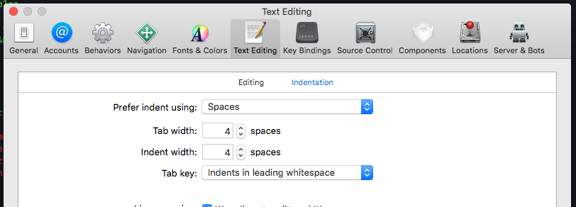

**Swift Style Guide - City**
====


Table of Contents
======
- [Code Formatting](#code-formatting)
- [Naming](#naming)
- [Coding Style](#coding-style)
- [Comments](#comments)
- [Classes vs Structs](#classes-vs-structs)
- [Enums](#enums)
- [Use of Singletons](#use-of-singletons)
- [Dependency Injection](#dependency-injection)
- [Use Higher Order Functions ( map, filter, reduce )](#use-higher-order-functions---map--filter--reduce--)
- [Indentation Type   [CLARIFY DEFINITIONS]](#indentation-type----clarify-definitions-)
- [Declaring variables](#declaring-variables))
- [Generics](#generics)
- [Arrays](#arrays)
- [Dictionaries](#dictionaries)
- [Optionals](#optionals)
- [Initialisation](#initialisation)
- [Use of Self](#use-of-self)
- [Access Control](#access-control)
- [Life Cycle Methods](#life-cycle-methods)
- [Protocols](#protocols)
- [Early Returns](#early-returns)
- [IBAction](#ibaction)
- [Empty Life Cycle Methods](#empty-life-cycle-methods)
- [Incomplete Code](#incomplete-code)
- [Numeric Values](#numeric-values)
- [Completion Blocks](#completion-blocks)
- [Avoiding Retain Cycles](#avoiding-retain-cycles)

Code Formatting
======

#### Code Spacing

We use 4 spaces or 4 tabs (the default XCode setting)



#### Line Length

Avoid lines which are excessively long and use a suggested limit of of 160 characters per line.

To see a visual width guide in Xcode use:
 `Xcode->Preferences->Text Editing->Page guide at column: 160`

In order to enforce the above limit we can use **"Line-Wrapping"** which means dividing code into multiple lines which could otherwise occupy a single line.

Naming
=====
 * Use PascalCase for type names (e.g. struct, enum, class, typedef, associatedtype, etc.).
 * Use camelCase (initial lowercase letter) for function, method, property, constant, variable, argument names, enum cases, etc.
 * All constants that are instance-independent should be static. All such static constants should be placed in a marked section of their class, struct, or enum. For classes with many constants, you should group constants that have similar or the same prefixes, suffixes and/or use cases.
 * Names should be descriptive and unambiguous.
 *  Do use abbreviations,  shortened names, or single letter names.
  * Include type information in constant or variable names when it is not obvious otherwise.
  *  When naming function arguments, make sure that the function can be read easily to understand the purpose of each argument.
  * Protocols should be named using nouns if they describe what something is doing (e.g. Collection) and using the suffixes able, ible, or ing if it describes a capability (e.g. Equatable, ProgressReporting). If neither of those options makes sense for your use case, you can add a Protocol suffix to the protocol's name as well. Some example protocols are below.

Coding Style
====
* When writing methods, keep in mind whether the method is intended to be overridden or not. If not, mark it as final, though keep in mind that this will prevent the method from being overwritten for testing purposes. In general, final methods result in improved compilation times, so it is good to use this when applicable. Be particularly careful, however, when applying the final keyword in a library since it is non-trivial to change something to be non-final in a library as opposed to have changing something to be non-final in your local project.

* When writing methods, keep in mind whether the method is intended to be overridden or not. If not, mark it as final, though keep in mind that this will prevent the method from being overwritten for testing purposes. In general, final methods result in improved compilation times, so it is good to use this when applicable. Be particularly careful, however, when applying the final keyword in a library since it is non-trivial to change something to be non-final in a library as opposed to have changing something to be non-final in your local project.

* When using a statement such as else, catch, etc. that follows a block, put this keyword on the same line as the block.  Follow the 1TBS style here.


Comments
======
Only use comments when they are need to explain why a peice of code does something. Try to keep comments up-to-date and remember to remove those comments which are no longer valid.

In most cases you should avoid block comments written inline with code, this is because the code should be as self-documenting as possible (which means using meaningful variable and method names). However, methods *should* typicaly have doc block's which can be used to auto-generate documentation which is viewable in different places within Xcode.

When a method takes no parameters you can comment it like this:
```swift
    /// Loads the latest album values from the photo library backing store.
    func reloadAlbumsFromPhotoLibrary() {
        albums = PhotoLibrary.sharedInstance.albums
    }
```
Use **alt+cmd+/** to auto generate comments for methods which take pameters and try to describe each like this:
```swift
/// Generates and returns a thumbnail for the image using scale aspect fill.
///
/// - Parameters:
///   - image: image to generate thumbnail for
///   - thumbnailSize: a CGSize for how big the thumnail should be
/// - Returns: a UIImage
private func generateThumbnail(for image: UIImage, with thumbnailSize: CGSize) -> UIImage {
```

Comments starting with one of the below designators will be surfaced in the Xcode source navigator:
```
// MARK:- to make sections
// TODO: to remind you to update a bit of code
// FIXME: to remind you to fix somthing
```

SOURCE: Ref#: E

Classes vs Structs
======

Structure instances are always passed by value, and class instances are always passed by reference. This means that they are suited to different kinds of tasks. As you consider the data constructs and functionality that you need for a project, decide whether each data construct should be defined as a class or as a structure.

Reference types are stored in Heap and values in Stack. This means that Classes which are a reference type are allocated in the heap, whereas Structs which are a value types live in the Stack. Using structs is preferable if they are relatively small and copiable because copying is way safer than having multiple references to the same instance as happens with classes. Furthermore, since struct instances are allocated on stack, and class instances are allocated on heap, structs can sometimes be drastically faster.

Classes can have a greater propensity to become bloated because a class can only inherit from a single superclass. That can encourage the creation huge superclasses that encompass many different abilities that are only loosely related. Using protocols, especially with protocol extensions where you can provide implementations to protocols,will oftern allow you to eliminate the need for classes to achieve this sort of behavior. So this is one of the arguments for a POP approach in Swift.

#### Preferred
For the above reasons aim to **use Structs** whereever possible, unless there are strong arguments not to do this (Ref#: N).

As Swift.org put it: "As a general guideline, prefer structures and enumerations because they’re easier to reason about, and use classes when they’re appropriate or necessary. In practice, this means most of the custom data types you define will be structures and enumerations."

Enums
====
Enum is short for enumeration: enums in the C programming language are integer-based, however, enums in swift are a lot more flexible.

```swift
enum CompasPoint {
    case north
    case south
    case east
    case west
}
```
OR
```swift
enum CompasPoint {
    case north, south, east, west
}
```
(Ref#: L)

When using enums avoid writing out an enum type where possible :

Preferred
```swift
imageView.setImageWithURL(url, type: .person)
```
Not Preferred
```swift
imageView.setImageWithURL(url, type: AsyncImageView.Type.person)
```

Use of Singletons
====
The use of singletons, or the creation of a "sharedInstance" should generally be **avoided where possible**. There are a range of reasons for this:

1) They are generally used as a **global** instance, why is that so bad? Because you *hide the dependencies of your application in your code*, instead of exposing them through the interfaces. Making something global to avoid passing it around is a code smell to watch out for.

2) They violate the **Single Responsibility Principle** since they control their own creation and lifecycle.

3) They inherently cause code to be tightly coupled. This makes faking them out when running Unit Test against our code a lot more difficult in many cases.

4) They **carry state** around for the lifetime of the application. Another hit to testing since you can end up with a situation where tests need to be ordered which is a big no no for unit tests. Why? Because each unit test should be independent from the other.

However:

There are situations where we would use a singleton for the avoidance of Resource Contention (a conflict over access to a shared resource such as random access memory, disk storage, cache memory, internal buses or external network devices).

If you have some resource that
1/ can only have a single instance, and
2/ you need to manage that single instance,

There aren't many examples. A log file is the big one. You don't want to just abandon a single log file. You want to flush, sync and close it properly. This is an example of a single shared resource that has to be managed.

It's rare that you need a singleton.  A lot of times when you think you need a global, you're probably making a bad design mistake in your code.

(Ref#: I)

By using **Dependency Injection** to get instances to constructors that require them, one can alleviates the underlying need behind the global singltons.

Most typically, as seen below, we can use dependency injection to inject services into our ViewControllers as opposed to refering to singletons from inside our ViewControllers. *This goes toward the principle of Dependency Inversion.*

Dependency Injection
====
As mentioned above, one of the ways to avoid the use of Singltons in our code is using dependency injection. Let look at what that means. The term Dependency Injection is used to mean a technique where one object or static method supplies the dependencies of another object. Here the word dependency refers to an object which can be used (you could call it a service). “Injection” means the passing of a dependency to a dependent object or client that will use it.

The term “Dependency Injection” was coined my Martin Fowler in an article he wrote. In his article, Fowler explains that this is a particular method or set of methods for achieve Inversion of Control (IoC). From a **SOLID** design principle perspective, Dependency Injection can help us to achieve **Dependency Inversion** in our apps; we know that High-level modules should not depend on low-level modules, both should depend on abstractions. Abstractions should not depend on details rather details should depend on abstractions. With a DI approach, objects are given their dependencies *at run time instead of at compile time*.

**Unit Testing** our apps can prove hard when dependencies are tightly coupled because it’s harder to isolate component from each other and just test that one component. Consequently, *one of the key advantages of using dependency injection is that it can make unit testing our app a lot easier due to it’s promotion of this looser coupling*.

One issue with dependencies is that, when we use them, it can be easy to end up with tightly coupled modules, where there references all over the place, something we refer to as **Spaghetti Code**. In our code, we always want to achieve (as much as possible) a separation of concerns. This means that “each object or type should only know enough about its surroundings to do its work, and no more” (Ref# G).

## Constructor Injection
This type of injection involves injecting a dependency in the init method of an object.
#### Preferred
```swift
protocol Propulsion {
    func start()
}

class RaceCarEngine: Propulsion {
    func start() {
        print ("Vrrrooomm!!")
    }
}

class Vehicle {
    let engine: Propulsion
    required init (engine: Propulsion) {
        self.engine = engine
    }
    func forward() {
        engine.start()
    }
}

let raceCarEngine = RaceCarEngine()

var car = Vehicle(engine: raceCarEngine)

car.forward() // Output: Vrrrooomm!!
```

### Using DI With View Controllers

To use dependency injection with our view controlers we can do something like the below:

```swift
class SomeViewController: UIViewController  {
    private var analytics: AnalyticsEngine?
    
    // MARK:- Custom initializers allow for dependency injection
    init(analyticsService: AnalyticsEngine = Analytics()) {
        self.analytics = analyticsService
        super.init(nibName: nil, bundle: nil)
    }
    
    required init?(coder aDecoder: NSCoder) {
        fatalError("init(coder:) has not been implemented")
    }

    //... rest of view controller code
}
```

## Property Bassed
Instead of injecting an object’s dependencies in its initializer, they can simply be assigned afterwards...(Ref#: K).
```swift
class CarViewModel {
     var type = CarType?
}

let carViewModel = CarViewModel()
let carType = CarType(colour: .red, make: "Ford")
carViewModel.carType = carType
```

## Parameter Injection

On these John Sundell snippets we see use of Parameter Injection

Not Preferred
```swift
class MessageSender {
    static func send(_ message: Message, to user: User) throws {
        Database.shared.insert(message)
        let data: Data = try wrap(message)
        let endpoint = Endpoint.sendMessage(to: user)
        NetworkManager.shared.post(data, to: endpoint.url)
    }
}
```

Preferred
``` swift
class MessageSender {
    static func send(_ message: Message,
                     to user: User,
                     database: Database = .shared,
                     networkManager: NetworkManager = .shared) throws {
        database.insert(message)
        let data: Data = try wrap(message)
        let endpoint = Endpoint.sendMessage(to: user)
        networkManager.post(data, to: endpoint.url)
    }
}
```


Use Higher Order Functions ( map, filter, reduce )
====
We should always try to make use Swift's built-in higher order functions when transforming from one collection to another instead of interating though:

#### Preferred
```swift
let stringOfInts = [1, 2, 3, 4].flatMap { String($0) }
```
```swift
let evenNumbers = [4, 8, 15, 16].filter { $0 % 2 == 0 }
```

OR

```swift
let numbers = [1, 2, 3, 4]
numbers.forEach { print ($0) }
```

#### Not-Preferred
```swift
var stringOfInts: [String] = []
for integer in [1, 2, 3] {
    stringOfInts.append(String(integer))
}
```
OR 
```swift
let numbers = [1, 2, 3, 4]
for number in numbers {
    print($0)
}
```

**It is worth noting however that in cases where we will want to be able to exit a loop early, say if a certain condition has been met, we would still use something like a for loop for that type of case.**


Indentation Type
======
#### Option One: 1TBS (OTBS)

Pricipally using a brace even if there is an option to not use a brace, such as with one line statements.

#### Variant A (preferred for Swift):

When using a statements like else or catch  that follows a block, put the keyword on the same line as the block using the 1TBS style.

#### Preferred
```swift
if self.isEnabled {
  // Do something
} else {
  // Do something else
}
```

*So we should always use a consistent style, and that style, as dictated by Apple standard code etc is to place the opening brace on the same line (not the next line).*

References: 
A: https://github.com/PoshCode/PowerShellPracticeAndStyle/issues/81

Declaring variables
======

* Only specify the object type if it is not set immediately. The object type can often be inferred from the value set.
* `:` should be positioned to the right of the variable name with no spacing.

#### Preferred
```swift
var title: String
```
or
```swift
var title = "a"
```

Generics
======

Using Generics means using "Parametric Polymorphism" (essetially code is written without reference to any specific type).

### Generic Parameter Clause

To use generics in Swift we use what is known as a Generic Parameter Clause which is a comma-separated list of generic parameters enclosed in angle brackets (<>) . Each generic parameter taking the form:

```
<type parameter: constraint>
```

 The “constraint” part is a reference to a type parameter which inherits from a specific class or conforms to a particular protocol (like Comparable) or protocol composition.

```swift
func mergeSort <T: Comparable>(_ array: [T]) -> [T] {
    guard array.count > 1 else {
        return array
    }
    let middleIndex= array.count / 2
    let leftArray = mergeSort(Array(array[0..<middleIndex>]))
    let rightArray = mergeSort(Array(array[middleIndex..<array.count>]))
    return merge(leftArray, rightArray)
}
```

Generics may also be used to increase type safety by setting expected types during declaration (as these expected types might be specified to be those which adhere to a particular protocol like Comparable).


Generic *type parameters* should be given descriptive, upper camel case names. However, when a type name doesn't have a meaningful relationship or role, then the use a **single uppercase letter like T, U, or V is preferred**.

#### Preferred
```swift
struct Stack<Element> { ... }
func write<Target: OutputStream>(to target: inout Target)
func swap<T>(_ a: inout T, _ b: inout T)
```
#### Not Preferred
``` swift
struct Stack<T> { ... }
func write<target: OutputStream>(to target: inout target)
func swap<Thing>(_ a: inout Thing, _ b: inout Thing)
```

## Using Generics with Protocols

### Associated Types

An associatedtypeis a placeholder for an unknown Concrete Type in a swift protocol which will require concretization on adoption at Compile time, and as such is seen as an example of Generics. In the words of Paul Hudson, "they mark holes in protocols that must be filled by whatever types conform to those protocols".

Here's an example:


"Associated types are effectively holes in a protocol, so when you make a type conform to this protocol it must specify what ItemType actually means".

( https://www.hackingwithswift.com/articles/74/understanding-protocol-associated-types-and-their-constraints )

### Benefits of Using Associated Type

Associated Types help specify the precise and exact Type of an object within a protocol sub-typing without polluting the Type definition.

"associated types allow the adopter of a protocol to provide multiple concrete types at compile time, without polluting the type definition with a bunch of type parameters. They're an interesting solution to the problem and a different kind of abstraction (abstract members) from generic type parameters (parameterization)"(http://www.russbishop.net/swift-associated-types).

N.B. associated types do differ from generic type parameters, although both have similar aims.

Arrays
======

```swift
let names: [String]
```

Dictionaries
======

```swift
let dictionaryItems = [String : AnyObject]
```

Optionals
======

Preferred style with using optionals is to always unwrap optional values using "Optional Binding".

It is not preferred to force unwrap the value using a bang "!" because this can lead to an exception and potentially a crash of your app.

## Optional Binding

### Optional Binding with `If / Let`

#### Preferred

```swift
if let title = someOptionalString  {
    print(title)
}
```

#### Not Preferred

```swift
if someOptionalString != nil {
    print (someOptionalString!)
}

```

### Optional Binding Using a Guard Statement

#### Preferred

```swift
func printThisIfYouCan (message: String?) {
    guard let myMessage = message else { return }
    print(myMessage)
}
```

### Nil-Coalescing Operator ("??")

Optionals can also be used by providing an alternative default value using the "Nil-Coalescing Operator", for example:

```swift
var optionalString: String?
// Commeting out the below line results is theAnwer being made equal to the defaultString:
// optionalString = "Set the value of this to something so it's not nil"
let defaultString = "Fall back to this"
let theAnswer = optionalString ?? defaultString
```

### Optional Chaining
Optional Chaining “lets you run code only if your optional has a value” such that it allows querying and calling properties, methods, and subscripts on an optional that could currently be nil.  If the optional contains a value the call succeeds, alternatively if the optional is nil, the call will return nil.

#### Example Usage
```swift
struct Cat {
    var name: String
    var favoriteFood: String
}

var myCat: Cat?

// commenting this line out would not break our code
myCat = Cat(name: "Mr Fur", favoriteFood: "Fish")

let catsFaveFood = myCat?.favoriteFood

if let catsFaveFood = catsFaveFood {
    print("My Cat's favorite food is \(catsFaveFood)")
}
```
You can also attempt to set a property’s value through optional chaining:

```swift
person.details?.name = "Clive"
```
Only if details is not nil will the name be set.


### Implicitly Unwrapped Optionals

Use these for IBOutlets, but avoid using them elsewhere if possible.

```swift
@IBOutlet weak var someLabel: UILabel!
```

Initialisation
======

Don't call the init methods on the class.

#### Preferred

```swift
let infoAlert = CityAlert(title: title, message: message, preferredStyle: .alert)
```

#### Not Preferred

```swift
let infoAlert = CityAlert.init(title: title, message: message, preferredStyle: .alert)
```

Initialising Empty Arrays

#### Preferred
```swift
var myArray = [MyClass]()
```

#### Not Preferred

```swift
var myArray: [MyClass] = []
```

Use of Self
======
### Most Guide Suggest Avoiding Using `self.` Where You Can
For conciseness, we could try to avoid using the `self.` prefix since Swift does not require it to access an object's properties or invoke its methods.

We could use self only when required by the compiler (in `@escaping` closures, or in initializers to disambiguate properties from arguments). In other words, with this approach, if it compiles without self then we would omit it.

However, this approach present one issue in that we don't explicitly define self.

#### Not Preferred
```swift
let setupMessage = "Setting Up Now"

    override func viewDidLoad() {
        super.viewDidLoad()
        setup()
        print (setupMessage)
    }
```

### Some Other Companies Have Typically Done the Opposite
Typically they use `self.` to explcitly denote the scope in which we are looking for a property. So we would use `self.` explicitly both for properties and for functions in that class.

Again, the advantage is that we always consistently and exiplicity define self, and don't rely on explicity attaining a refernce to it.

#### Preferred

```swift
private let setupMessage = "Setting Up Now"

    private func setup() {
        // do some setup
        print (self.setupMessage)
    }

    override func viewDidLoad() {
        super.viewDidLoad()
        self.setup()
    }
```

Access Control
======
"Access control restricts access to parts of your code from code in other source files and modules. This feature enables you to hide the implementation details of your code, and to specify a preferred interface through which that code can be accessed and used" (Ref#: J).

#### Preferred
```swift
private static let privateCode: Int
```
#### Not Preferred
```swift
static private let privateCode: Int
```
### Default Access Level

The default access level in swift is called "Internal" which "enables entities to be used within any source file from their defining module, but not in any source file outside of that module".

### Use of `open` & `public`

"Open access and public access enable entities to be used within any source file from their defining module, and also in a source file from another module that imports the defining module. You typically use open or public access when **specifying the public interface to a framework**. The difference between open and public access is described below."

Open access applies only to classes and class members, and it differs from public access as follows:

- Classes with public access, or any more restrictive access level, can be subclassed only within the module where they’re defined.
- Class members with public access, or any more restrictive access level, can be overridden by subclasses only within the module where they’re defined.
- Open classes can be subclassed within the module where they’re defined, and within any module that imports the module where they’re defined.
- Open class members can be overridden by subclasses within the module where they’re defined, and within any module that imports the module where they’re defined.

### Use of `private` & `fileprivate`

The `private` modifier should **always be used** where a property or method does not need to be accessed outside of a given class.

Futhermore, should you need to access methods or functions in extension that are not part of the class but are part of the same .swift file, then you would used `fileprivate` as this means that a method or property is accessible only to elements or objects within the same swift file. A good example of this is using extentions with a TableView where you want to be able to access some shared properties.

Life Cycle Methods
======

Life Cycle methods should be at the beginning of a class and should be in the order that they happen in the view's life cycle.

```swift
func viewDidLoad
func viewWillAppear
func viewDidAppear
func viewWillDisappear
func viewDidDisappear
func deinit
```
Protocols
====

More Info Here: https://docs.swift.org/swift-book/LanguageGuide/Protocols.html

## Protocols Oriented Programming (POP)

"A protocol defines a blueprint of methods, properties, and other requirements that suit a particular task or piece of functionality. The protocol can then be adopted by a class, structure, or enumeration to provide an actual implementation of those requirements. Any type that satisfies the requirements of a protocol is said to conform to that protocol" (Apple Dev Docs).

Swift protocols are different because they support:

- Protocol Inheritance
- Protocol Extensions
- Default Implementation
- Associated Types (Generics)
- Can be conformed to by Structs and Enums (value types) as well as Classes (reference types).


Protocols Oriented Programming (POP) is "A version of OOP which emphasizes **composition over inheritance** as a method of functionality-sharing by using Swift's version of Protocols".

Protocol OP (POP) is a new approach for programming which you decorate your classes, structs or enums using protocols. Swift does not support multiple inheritance, therefore a problem can happen when you want to add multiple abilities to your class. POP lets you to add abilities to a class or struct or enum with protocols which supports multiple implementations (Ref#: F).

### Use with Value Types

### Local Reasoning
Using POP can help with Local Reasoning, that is, figuring out what a bit of code is doing just by looking at that code in isolation.

#### Preferred

*[INSERT SOME GOOD POP EXAMPLE CODE HERE]*

#### Not-Preferred

*[INSERT SOME CONTRASTING NON-POP INHERITANCE EXAMPLE]*

## Adopting a Protocol

When your class adopts a protocol such as `UITableViewDataSource` or `UITableViewDelegate` etc. These should be placed in an extension at the bottom of the class to clearly group the code. And this should be prefixed with the Swift equivalent of pragma mark ("`//Mark:` or `//Mark:-`")

#### Preferred

```swift
class MyClass {
   // Class methods
}

//MARK:- TableViewDataSource
extension MyClass: UITableViewDataSource {
   // Table view data source methods
}

//MARK:- TableViewDelegate
extension MyClass: UITableViewDelegate {
   // Table view delegate source methods
}
```

### Not Preferred
```swift
class MyClass: UITableViewDataSource, TableViewDelegate {
   // All methods
}
```
## Protocol Inheritance

"A protocol can inherit one or more other protocols and can add further requirements on top of the requirements it inherits. The syntax for protocol inheritance is similar to the syntax for class inheritance, but with the option to list multiple inherited protocols, separated by commas:"
```swift
protocol InheritingProtocol: SomeProtocol, AnotherProtocol {
    // protocol definition goes here
}
```

Early Returns
======

To make the flow of code easier to read and to minimise nesting blocks, use early returns

e.g instead of:

```swift
func myMethod() {
    if someCondition = true {
        // some code
    } else {
        // alternative code
    }
}
```

Replace with:

```swift
func myMethod() {
    if someCondition = true {
       // some code
       return
    }
    // alternative code
}
```

IBAction
======

When adding an IBAction from a NIB, make sure to remove the sender unless you explicitly need to use it.

#### Preferred

```swift
@IBAction func listSelected() {
```

#### Not Preferred

```swift
 @IBAction func listSelected(_ sender: Any) {
```

Empty Life Cycle Methods
======

Remove any stub methods that are added by Xcode when creating new classes unless you add code within the methods

Incomplete Code
======

During development there may be scenarios where code is incomplete or elements within the UI cannot yet be fully connected. To ensure these are easy to find add `//TODO`  comments in areas of code that need to be revisited.

Furthermore, for UI elements that are not yet connected to functioning code, you can typically add some placeholder alert, to be shown to the screen.

This will prevent bugs being raised by the QA team against elements that "don't respond".

Numeric Values
======

In scenarios where a numerical value is needed, i.e padding, a multiplier etc. never use hard coded values inline. If it's a value that will never change then define a constant at the top of class so that all values are easily found and have an explanatory name. If the value could change then it should go in the "settings" (in a context where using a CMS system to manage such values remotely).

```swift
let cellHeight: CGFloat = 44.0
let sectionHeaderHeight: CGFloat = 58.0
let itemCellHeight: CGFloat = 95.0
```
[Maybe add better example code here]

Completion Blocks
======

Using a completion block looks like this. In the case of swift we can pass a closure to a function, that closure will have a type. We might declare this in advance using a `typealias`.

``` swift
func hardProcessingWithString(input: String, completion: (result: String) -> Void) {
	...
	completion("we finished!")
}
```

### Escaping Closures
A closure is said to escape a function when the closure is passed as an argument to a function, but is called/invoked after the function returns. An escaping closure lives outside the function it is passed to, but a non-escaping closure lives within the function it is passed to, and thus it has to execute before the function returns. In Swift 3 or later, when you declare a function that takes a closure as one of its parameters, you write `@escaping` before the parameter’s type to indicate that the closure should be of the escaping type.

"Non-escaping closures passed in as arguments are guaranteed to not stick around once the function returns."

"If a closure is non-escaping, there are some potential optimizations. Since the closure won’t escape the function, the compiler can optimize storage and calling for the closure."(https://swiftunboxed.com/lang/closures-escaping-noescape-swift3/)


Where completion blocks are compatible, simply pass them through to any nested method calls rather than creating a completion block simply to call the passed in block:

# Avoiding Retain Cycles

## Retain Cycles in Closures

One potential issue with **closures** is the possibility of creating retain cycles: Indeed, retain cycles tend to happen when you have two objects which each hold strong pointers to one another, either directly so or indirectly, meaning they can’t get deallocated by Automatic Reference Counting (ARC) (generally to solve such cycles one can analyze your app's object graph and one can use of value types to prevent cycles altogether).

Closures are a Reference Type in Swift, where variables and constants captured by a Swift closure are captured by reference from their enclosing scope (much like `__block` marked parameters in Objective-C which get captured by reference by Objective-C blocks). The default is for a closure expression to capture parameters from its scope using strong references, however (to avoid retain cycles), we may want to modify our references to a captured values.

To overcome retain cycles in closures we use the reference modifiers of `weak` or `unowned`. We want to use a weak reference whenever it is valid for that reference to become nil at some point during its lifetime, or in other words when the other instance has a shorter lifetime and thus could be the first to be deallocated. Alternatively we could use the unowned reference if we know that the reference is never going to become nil once it has been initialized.

In order to achieve the above with closures we use a method called **Capture Lists** which look like square brackets at the start of a closure (i.e. `[weak self]`). This Capture List is actually an array of things to be captured and defines the rules to use when capturing one or more reference types within the closure’s body. We also have the option to create new named variables within a Capture List.

For example:
```swift
        DispatchQueue.main.async { [weak self] in
            let secondsPerBanner = TimeInterval(SettingFloat("BannerTimer", defaultValue: 5.0))
            if let strongSelf = self {
                strongSelf.timer?.invalidate()
                strongSelf.timer = nil
                let timer = Timer.scheduledTimer(timeInterval: secondsPerBanner,
                                                 target: strongSelf,
                                                 selector: #selector(strongSelf.nextBanner),
                                                 userInfo: nil,
                                                 repeats: true)
                strongSelf.timer = timer
                RunLoop.current.add(timer, forMode: RunLoop.Mode.common)
            }
        }
```


*So therefore in Swift, we have the option of using a Capture List inside a closure to prevent a retain cycles. Using a capture list means you must also use the in keyword, even when you are omitting the parameter names, parameter types, and return type. Entries in the capture list are initialized when the closure is created, and for each entry a constant is initialized to the value of the constant or variable that has the same name in the closure’s surrounding scope. So therefore the “capture list defines the rules to use when capturing one or more reference types within the closure’s body. As with strong reference cycles between two class instances, you declare each captured reference to be a weak or unowned reference rather than a strong reference”.*

## Exteding Object Lifetime in a Closure

Now we will look at something that has been called colloquially **"strong-weak dance"** which as iOS developers (in the post ARC world) we find ourselves doing in both Swift Closures and Objective-C blocks:  So, sometimes may want to extend the lifetime of the objects we are using inside a closure (such as where we want all the parts of a process to complete even if a parent might go out of scope), to do this we this pattern:

```swift
[weak self] //as your Capture List
```

and then inside the closure:

```swift
guard let strongSelf = self else { return }
```

This then looks like this:
#### Preferred
```swift
resource.request().onComplete { [weak self] response in
  guard let strongSelf = self else { return }
  let model = strongSelf.updateModel(response)
  strongSelf.updateUI(model)
}
```

There’s also another similar way of doing this using backticks, such as the following code snippit:

```swift
{ [weak self] () -> void in
    guard let `self` = self else { return }
    self.doSomething
}
```

If we’re not totally sure whether self will outlive the lifetime of our closure we should typically use `[weak self]` instead of `[unowned self]` this is because using `[unowned self]` could lead the app to crash if self is released before the closure returns.

#### Preferred
```swift
someFunctionWithAnEscapingClosure() { [weak self] (error) -> Void in
    // We can use a weak self like this
    self?.doSomething()

    // or when extending the object lifetime
    guard let strongSelf = self else {
        return
    }
    strongSelf.doSomething()
}
```

#### Not Preferred
```swift
// might crash if self is released before response returns
resource.request().onComplete { [unowned self] response in
  let model = self.updateModel(response)
  self.updateUI(model)
}
```
#### Not Preferred
```swift
// deallocate could happen between updating the model and updating UI
resource.request().onComplete { [weak self] response in
  let model = self?.updateModel(response)
  self?.updateUI(model)
}
```

## Reference Cycles due to the Delegate Pattern

One source of a reference cycle can be the use of a common pattern iOS design pattern called the Delegate Pattern. This can particularly happen if we create a reference to a delegate, but we forget to make it weak, something like this:

```swift
class SendingViewController {
    var delegate: SendDataDelegate?
}
```

Instead, we should do this:

```swift
class SendingViewController {
    weak var delegate: SendDataDelegate?
}
```


What could happen is that if we delegate was alive elsewhere and the view controller went out of scope, since the reference was (in the first case) strong the view controller could be kept alive.

*One thing that might get missed here is that we might typeically need to ensure that the are protocol definitions are class bound. The modern systax for doing this looks somethiing like this:*
```swift
protocol NotificationConfigurationGroupDataModelDelegate: AnyObject {
    func didSelectConfigureGroup(group: NotificationConfigurationGroup, type: NotificationConfigurationType)
}
```
This is exactly the same as the this syntax, which we can actually also use since (after Swift 4) it parses identically, however some claim that the above is now prefered over the below syntax.
```swift
protocol DetailViewControllerDelegate: class {
   func didFinishTask(sender: DetailViewController)
}
```
Reference: https://useyourloaf.com/blog/class-only-protocols-in-swift-4/

For more on AnyObject see:
https://developer.apple.com/documentation/swift/anyobject


## References

A: https://github.com/raywenderlich/swift-style-guide

B: https://github.com/linkedin/swift-style-guide

C: https://swift.org/documentation/api-design-guidelines/

D: https://google.github.io/swift/

E: http://nshipster.com/swift-documentation/

F: https://medium.com/nsistanbul/protocol-oriented-programming-in-swift-ad4a647daae2

G: https://developer.apple.com/videos/play/wwdc2016/419

H: https://developer.apple.com/videos/play/wwdc2016/416

I: https://stackoverflow.com/questions/137975/what-is-so-bad-about-singletons

J: https://medium.com/@abhimuralidharan/swift-3-0-1-access-control-9e71d641a56c

K: https://medium.com/@johnsundell/different-flavors-of-dependency-injection-in-swift-6b001c18dcad

L: https://appventure.me/2015/10/17/advanced-practical-enum-examples/

M: https://docs.swift.org/swift-book/LanguageGuide/Protocols.html

N: https://docs.swift.org/swift-book/LanguageGuide/ClassesAndStructures.html

O: https://developer.apple.com/documentation/swift/choosing_between_structures_and_classes

P: https://github.com/airbnb/swift
